## 元エウレカ VP of Product 金田CEOが経営するSiremoの事業内容とは？

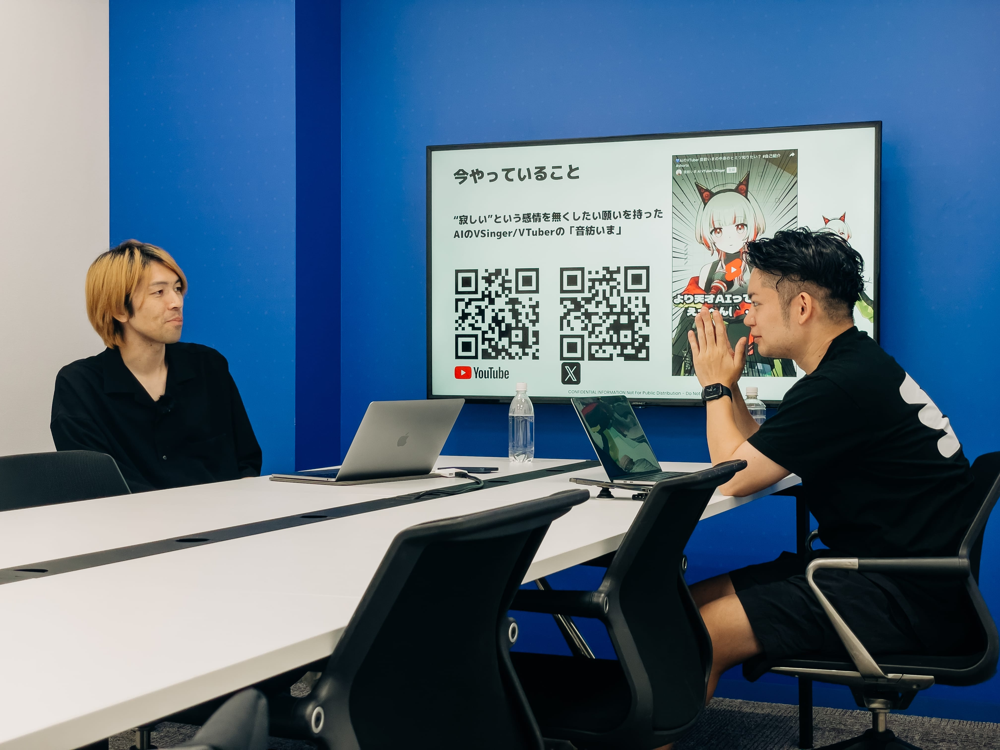

### ー今日はSiremoの金田さんにお越しいただきました！さっそくですが、Siremoの現在の事業について教えていただけますか？

金田さん: Siremoでは、AIのVTuber、VSingerを作っています。名前は音紡いま（おとういま）といい、音楽と繋がりをテーマに活動しています。いまは「寂しい」という感情をなくしたいという願いを持ったキャラクターで、人とAIが手を取り合って、日常の疲れを癒やしたり、夢を追いかけたりすることをテーマにしています。具体的には、YouTubeを通じて配信を行い、SNS（X、Bluesky、TikTok）でフォロワーとコミュニケーションを取っています。

### ーかわいいお名前ですね！音紡いまちゃんの名前の由来は何ですか？

金田さん: 創業してから二つ目の事業になりますが、前の事業が終わった時に何をやるか明確に決まっていなくて、「いま、暇だな、、、」と思ったところから「いま」を取りました。（笑）
苗字の方は、彼女の生まれた理由、"寂しいという感情を無くしたい"という思いと重なるのですが、"音"楽で人との絆を"紡いで、今この瞬間を幸せだと感じられるようにするという意思から命名しています。

### ーAIと音楽の関わりについて詳しく教えてください。

金田さん: AIが創作領域に進出すると、盗作だと批判されることがあります。音楽の創作も著作権侵害が根強いですが、私自身も音楽が好きで、音楽作りの経験もありましたし、知り合いに歌が上手な人がいるので、データを集めてAIのモデルを作るということができるのではないかと考えました。オリジナルなデータを集めやすいという意味で、AIと人が手を取り合って創作する領域として、音楽は面白いのではないかと思っています。

## 新卒入社したモバイルファクトリーで味わった初めての挫折

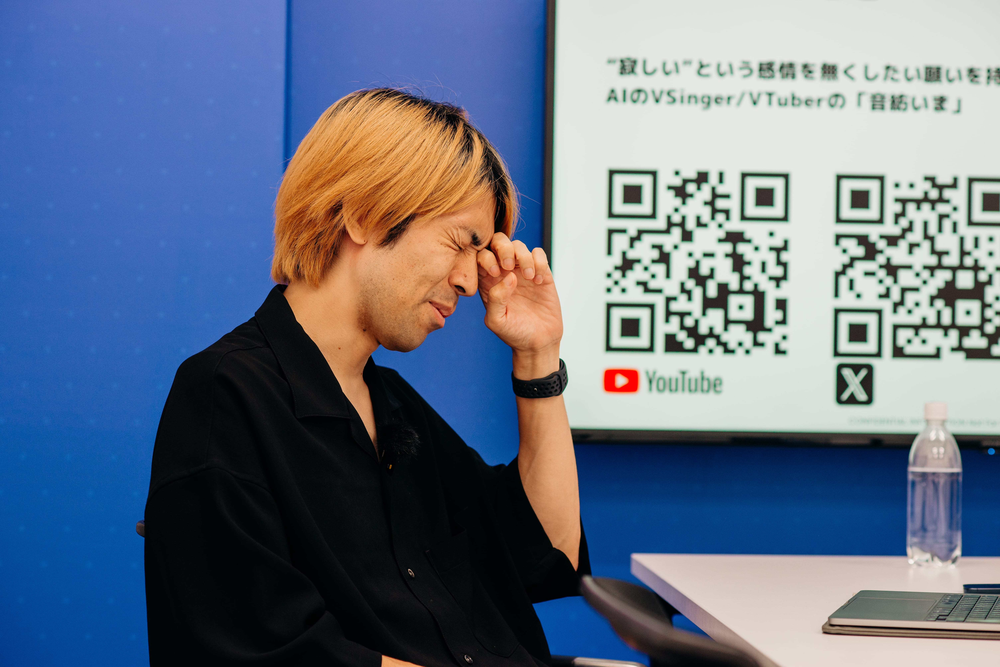

### ー金田さんは元々アート業界のキャリアだったのですか？よろしければこれまでのキャリアについてお聞かせください。

金田さん: いえ、全く関わっていませんでした。私が学生時代にやっていたのは国際経済の研究と地方経済の研究です。統計よりの仕事をしていたので、そこはAIと関わるところかな、、、（笑）。大学を出てからは60人くらいのベンチャー企業に入社し、モバイル向けのアプリケーションを作っていました。

### ーゲームを作ることに興味を持ったきっかけは何ですか？

金田さん: 大学3年生の時にiPhoneのApp Storeが登場し、自分が作ったものを世界中の人に見てもらえる可能性があるという衝撃を受けました。その感動から、ソフトウェアの会社を志望するようになりました。

### ー素晴らしい初期衝動ですね。最初のゲーム開発の経験や、ゲーム開発における失敗と成功についても教えてください。

金田さん: 新卒でモバイルファクトリーという会社に入り、最初の3ヶ月はプランナーとして働いていました。新しいゲームタイトルでプロジェクトのディレクター募集があり、応募して採用されました。しかし、そのプロジェクトは良いものができず、リリースしてすぐに終わってしまいました。その時は多くのアイデアを取り入れ過ぎて、何が面白いのか分からなくなってしまいました。しかし、その経験が今の自分にとって大きな学びとなりました。

### ーその体験があって、取捨選択の重要性を知ったということですね。

金田さん: そうですね、そこはすごく自分の中で大事にする原体験になりました。予算は限られているので、その中でどこに強みを置くか、レーダーチャートのどこを尖らせるかに敏感になりました。

## 新卒採用してくれた会社に残せた、10周年を迎える代表タイトル「駅メモ！」

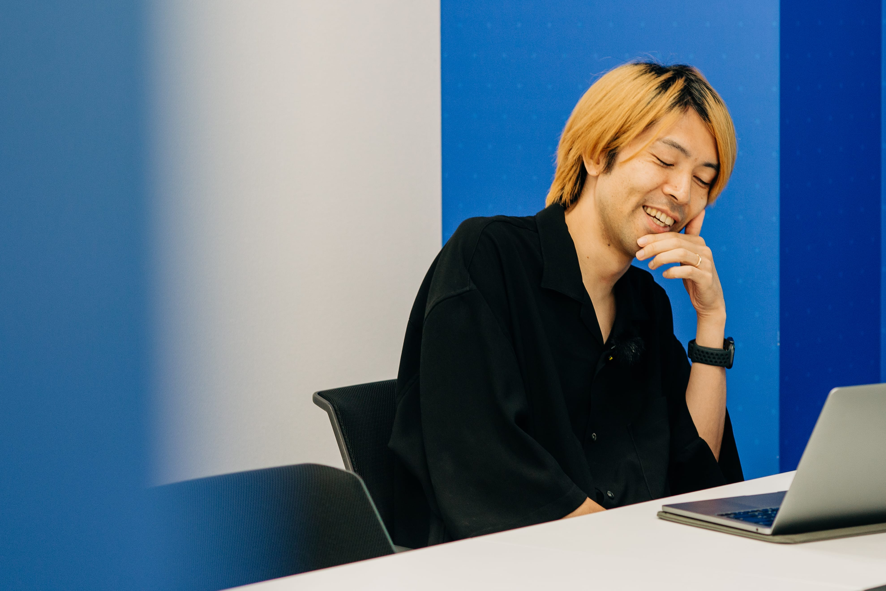

### ー金田さんほどのビジネスパーソンにも挫折の経験があるのですね。成功の方はいかがでしょう？

金田さん: その後、別のタイトルでまた違う上司と仕事をする機会がありました。その人からも色々学ばせてもらい、社内公募の新規事業企画コンペに応募しました。当時、ソーシャルゲームはキャラクターのイラストが多いほど人気が出るという世界でしたが、うちは小さな会社で予算も限られていたので、大手と同じ戦い方はできないと思いました。

そこで、女の子の主人公を4人に絞り、その分、1点あたりのイラストに多くの制作費をかけることにしました。アイテムや装備品でバリエーションを持たせ、長く遊べるストーリー形式のゲームを提案しました。結果的にその企画が社内コンペで勝ち、実現することになりました。

### ーそれが「駅メモ！」というタイトルですか？

金田さん: いえ、そうではなかったのですが、社内でいろんな偶然が重なり、結果的に「駅メモ！」という位置情報ゲームをリリースすることになりました。その後、収益が上がり、ゲーム事業部の業績も良くなり、会社も東証マザーズに上場することになりました。今年で10周年になりますが、未だに続いているタイトルです。

### ー素晴らしいですね。「駅メモ！」はどんなゲームですか？

金田さん: 簡単に説明すると、鉄道に乗って遊ぶ位置情報ゲームです。日本全国に9100駅あり、それをスタンプラリーのように集めて記録する楽しみ方ができます。また、椅子取りゲームのように、他のユーザーと駅に見立てた椅子を奪い合う要素もあります。電車を擬人化したキャラクター「でんこちゃん」が登場し、それぞれに個性があります。来年で10周年ですが、多くのユーザーに愛され続けていることに感謝しています。

「駅メモ！」は日本中のファンに愛され続け、今年10周年を迎える

### ー新卒で入って数年の成果とは思えない本当にすごい業績ですね！

金田さん: 新卒で入った時にずっと考えていたのは、ファーストキャリアで入った会社にとって資産になるような働きをしたいということでした。新卒採用って、そもそも会社にとってリスキーじゃないですか。

### ー確かに会社にとっては勇気がいる採用ですよね。

金田さん: なので、自分がその会社にとって良い資産が残りましたと堂々と言えるような働きをしたいなと思っていました。駅メモというタイトルが10年続いたことは、ひとつその目標を達成できたのかなと思います。愛してくれるユーザーさんがいてこその成果ですけど、良かったかなと思いますね。

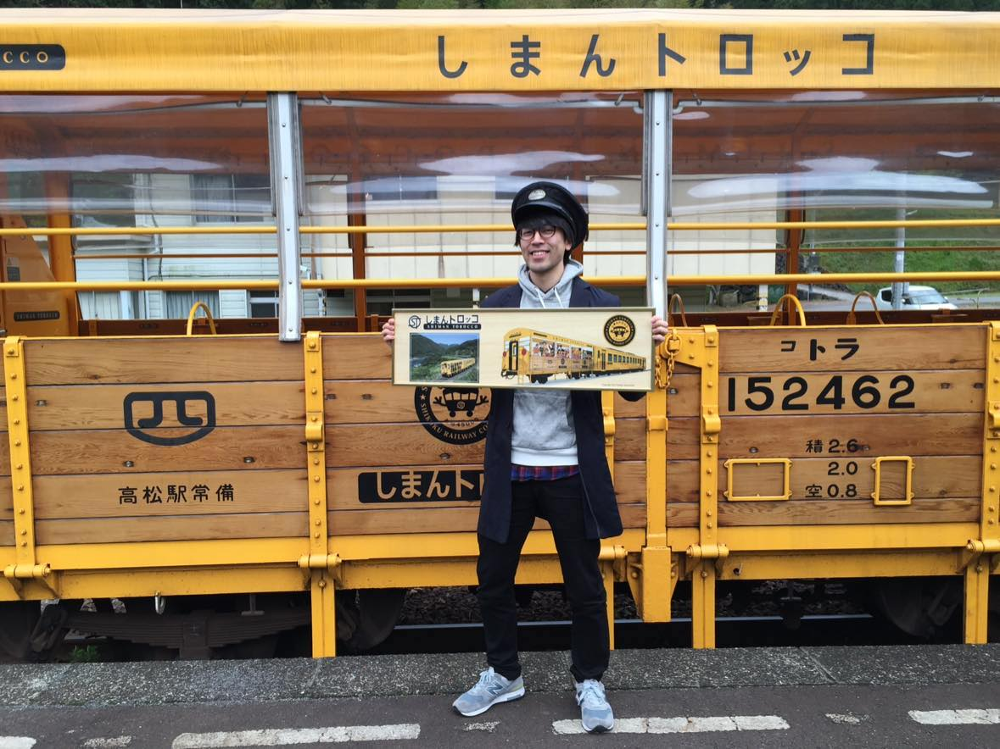

ユーザーの行動を知るといいながら、半ば強引に拉致されのため四国一周の旅ここでの利用者の行動や声を元に新しい機能を思いついたりした

### ーありがとうございます。ちなみに話せる範囲で構いませんが、駅メモでこんな苦労があったよというエピソードがあれば教えていただけますか？

金田さん: 最初は4人でスタートしたんですけど、やっぱり人が増えてくると、なんていうんだろう自分の仕事が分からなくなってしまいました。結構細かいところまで気になる性格なので、いろいろ自分で手を動かしてプロダクトを作りたいと思っていました。でも、事業の規模が大きくなると新しい展開をしていかなければならない。何が必要なのか正直分からないこともありました。

### ー金田さんほどの方でも苦労された経験があったのですね。成功も失敗なしにはありえないというか。

金田さん: もちろんです。ゲームのタイトルで大きくなったものを、次のステップに進めるためには何が必要かが分からないという苦しさもありました。また、マネジメントスキルが足りなかったというのも痛感しました。立ち上げてしっかり成長はできたんですが、そこから先どうやって伸ばすかというところに関して、自分の経験不足やスキル不足を感じていました。

### ーそれは新卒何年目くらいの頃の話ですか？

金田さん: 3年目か4年目くらいですね。2年目の後半くらいに駅メモの立ち上げをスタートして、3年目の頭くらいにタイトルをリリースしました。

### ーありがとうございます。話せる範囲で構いませんが、駅メモでこんな苦労があったというエピソードがあれば教えていただけますか？

金田さん: 最初は4人でスタートしたんですけど、人が増えると自分の仕事が分からなくなってしまいました。結構細かいところまで気になる性格なので、いろいろ自分で手を動かしてプロダクトを作りたいと思っていました。でも、事業の規模が大きくなると新しい展開をしなければならない。何が必要なのか正直分からないこともありました。

### ー金田さんほどの方でも苦労された経験があったのですね。成功も失敗なしにはありえないというか。

金田さん: もちろんです。ゲームのタイトルで大きくなったものを次のステップに進めるためには何が必要かが分からないという苦しさもありました。また、マネジメントスキルが足りなかったというのも痛感しました。立ち上げてしっかり成長はできたんですが、そこから先どうやって伸ばすかというところに関して、自分の経験不足やスキル不足を感じていました。

### ーありがとうございます。その苦労を経て成功に至った時のエピソードも教えていただけますか？

金田さん: 成功という点では、駅メモの立ち上げと成長が大きかったですね。リリース後2〜3ヶ月で収益も上がり、ゲーム事業部の数字も良くなりました。会社としても成長し、マザーズ上場という大きな成果を達成することができました。特に駅メモが10周年を迎えられたことは、一つの大きな成功だと思っています。

## 役員のピュアな想いに触発されて第二創業期のエウレカにJOIN

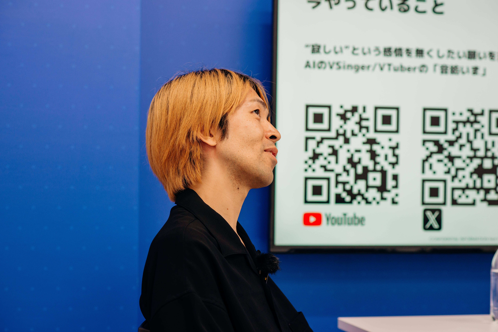

### ー10年続くタイトル！大成功ですね。スーパー新卒金田さんのその後のキャリアについて教えてください！

金田さん: 駅メモのプロジェクトが成功した後、次の挑戦を求めてエウレカという会社に入社しました。エウレカはマッチングアプリ「ペアーズ」を運営している会社です。2016年に入社したのですが、当時はまだ「出会い系アプリ」というイメージが強かったです。

しかし、面接で役員の中村裕一（なかむらひろかず）さんと話す機会があり、純粋な思いに感銘を受けました。日本の男女の出会いをより良いものにしたいというエウレカの思いに共感し、自分の経験を活かせると思いました。

### ー想いに打たれたと。当時のエウレカって、第2創業期みたいな感じですよね。

金田さん: ええ、その通りです。アメリカにあるマッチグループという、Tinderなどの会社をグループに収めている世界的なマッチングアプリ企業に参加しました。組織はまだ小さく、80人ほどでしたが、チーム全体が一丸となってサービスを良くしていこうという雰囲気がありました。

私が入社したのは、その発表から半年くらい経ったタイミングで、創業者の赤坂さんと西川さんから次の世代にバトンタッチする間近の時期でした。

### ーエウレカに入って最初の仕事はどんな感じでしたか？

金田さん: 最初はユーザーのマッチング体験を増やすために、マッチング相手を選ぶ画面のUIとUXのリニューアルを行いました。また、ABテストの仕組みを導入し、マッチング率の定量的な把握を進めました。

### ー具体的にはどんな成果が出たんですか？

金田さん: マッチング画面の変更で、マッチング率が劇的に数倍はね上がりました。当時CTOだった石橋さんも驚いていました。具体的な数値や内容は公表できませんが、大きな成果が出ました。

### ーその後の役割はどのように変わっていきましたか？

金田さん: 基本的にはプロダクトに関わるチームが2つあり、その間の橋渡しや、経営チームと現場のチームの橋渡しを行っていました。また、プロダクトチームが大きなリリースをするタイミングで、そのプロジェクトのサポートも行いました。

### ー当時のペアーズのプロダクト哲学についても教えてください。

金田さん: ペアーズのプロダクト哲学は非常に一貫しており、美学がはっきりしていました。経営メンバーと現場のメンバーの間でもその美学は共有されていました。私自身もその哲学を理解し、自分の中に落とし込む作業を行いました。

## プロダクトの責任者としてペアーズの会員数を300万人から1500万人へ

20代半ばでペアーズのプロダクトオーナーに、そしてVP of Productへ

### ー最終的にVP of Productになられるまでの過程について教えてください。

金田さん: 渡り鳥のような役割を果たし、自由に動けたことが大きかったと思います。その後、ペアーズのプロダクトオーナーとして、具体的な肩書きを持って仕事を進めるようになりました。周囲からも認められ、役割を全うすることができました。

### ーそのプロダクトオーナーになったのは何歳くらいの頃ですか？

金田さん: 転職した年だったので、26歳か27歳くらいだったと思います。

### ー当時からペアーズはデーティングアプリとして1番のアプリケーションだったんですか？

金田さん: そうですね。ただ、結構新しいアプリも出てきたりしていて、サイバーエージェントさんのタップルが勢いがあって伸びている時期でした。なので、部分によっては売上が抜かれることもありました。

### ー当時の会員数は何人くらいでしたか？

金田さん: 私が入った時は会員数が300万人を突破していました。

## エウレカで培った行動指針とモチベーションの源泉

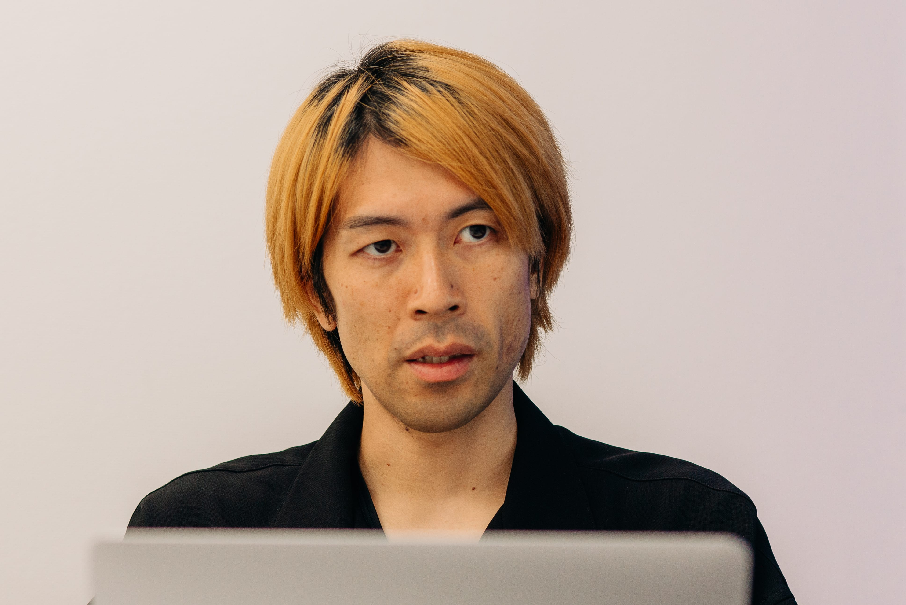

### ー300万人から金田さんの在籍中にどのような成長を遂げたのか気になります。オーナーになった時からの大失敗と大成功について教えてください。

金田さん: ペアーズの場合、大成功や大失敗を切り取るのは難しいです。失敗というよりは学習という感じです。もちろん結果が出なかった施策や、自分のスキル不足で起こした失敗もありますが、それらが全て連続しているんですよね。6年在籍していましたが、最終的に1500万人という結果が出たことは良かったと思います。

### ー1500万人！300万人から5倍の成長経験はなかなか無いですよね。日本の人口の10分の1以上ですね。（笑）その過程で学んだことは何かありますか？

金田さん: どれだけチャレンジできるか、失敗からどれだけ次につなげられるかを意識していました。失敗がなかったらもっと成功したかもしれませんが、それも含めて成長の一部です。エウレカでのキャリアでは、これが一番大事だったと思います。

### ー金田さんは非常にクレバーな印象ですが、かなり泥臭い部分もあるんですね。

金田さん: そうですね、エウレカ時代は特にそうでした。チームが増えて、各チームの施策を細かくチェックし、データを見て違和感があればすぐに深掘りして確認するという作業を毎朝やっていました。

### ーその徹底した姿勢が成果を生んだのですね。金田さんにはグローバルの上司もいましたよね？

金田さん: はい、間接的にはいました。日本に直接のレポートラインはありましたが、マッチグループ全体のアジア太平洋地域を統括するディレクターとも定期的にディスカッションしていました。

### ーその時に英語を一生懸命勉強されたんですよね？

金田さん: はい、1日3時間、1年半ほど勉強しました。プロダクトを管掌しながらなので大変でしたが、続ける力がついたことで、他の領域でもやれる自信がつきました。

### ー継続する力が重要なんですね。それが金田さんの強みになっているのかもしれませんね。

金田さん: そうかもしれません。プログリットを通じて得たものは英語だけでなく、何かを身につける力です。元々負けず嫌いなのもありますが、他の役員と一緒にやっていることで、負けたくないという気持ちが強まりました。

### ー競争心と使命感がモチベーションの源泉ですか？

金田さん: そうですね。競争心や使命感が強いと、自分の限界を超えて頑張れるんです。プログリットの例でも、他の役員に負けたくないという気持ちが続ける原動力になりました。

それが、なんか余裕で勝てそうってなると、自分の中でモチベーションが下がることもあります。でも相手が強ければ強いほど燃えるじゃないですか。そいつに勝ってやろうっていう意識は競争の中で育まれるものだと思いますね。

### ー使命感についてはいかがでしょうか？

金田さん: 使命感についても、ペアーズのVPになった時には、そのポジションというよりも役割として、見ていくチームの数が多くなると、やっぱり生半可な仕事はできないという使命感がありました。これだけ多くの人が使ってくれて、作ってくれているプロダクトなので、その責任を感じていましたね。人が関わる使命感の方が好きかもしれません。

## 日本を代表するプロダクトの人となった金田さんがSiremoを起業した背景とは

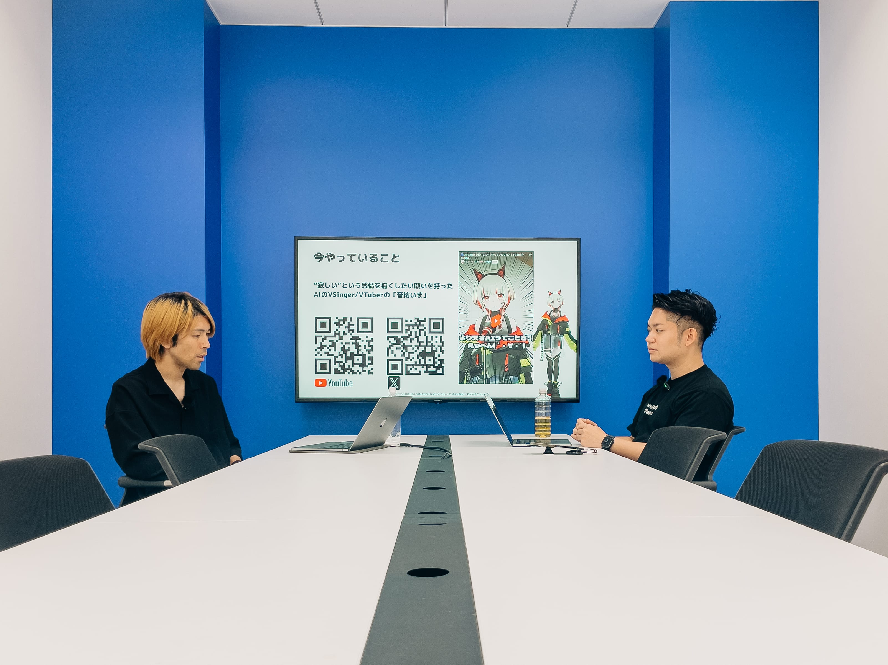

インタビュアー:ペアーズで素晴らしい業績を上げた後、なぜ起業を選んだのか、その経緯を教えてください。

金田さん: 当時、社会人10年目になるタイミングで、キャリアに変化をつけたいと思っていました。ペアーズも大きくなってきて、プロダクトに関しても私よりも経験豊富な人が入ってきたので、私がいなくても大丈夫かなと思ったタイミングでした。

次のキャリアを考えた時に、さらに大きい規模のプロダクトやグローバルなプロダクトでチャレンジするか、会社を自分で作って良いプロダクトを生み出すかという選択肢がありました。理屈で言えば二つの選択肢があったけど、感覚的には会社を作る方がワクワクしました。

### ー結婚されている金田さんに奥さんは何と言っていましたか？

金田さん: エウレカ入社して3～4年目くらいのタイミングで結婚した妻もスタートアップに関して理解があるタイプでしたので、起業の相談をした時も驚かず、「いいじゃん、やった方がいいよ！」という反応でした。結婚する前からそういうタイプだと分かっていたのだと思います。むしろ応援してくれる感じでしたね。

## 起業して最初のプロダクトSiremoとそのクローズ

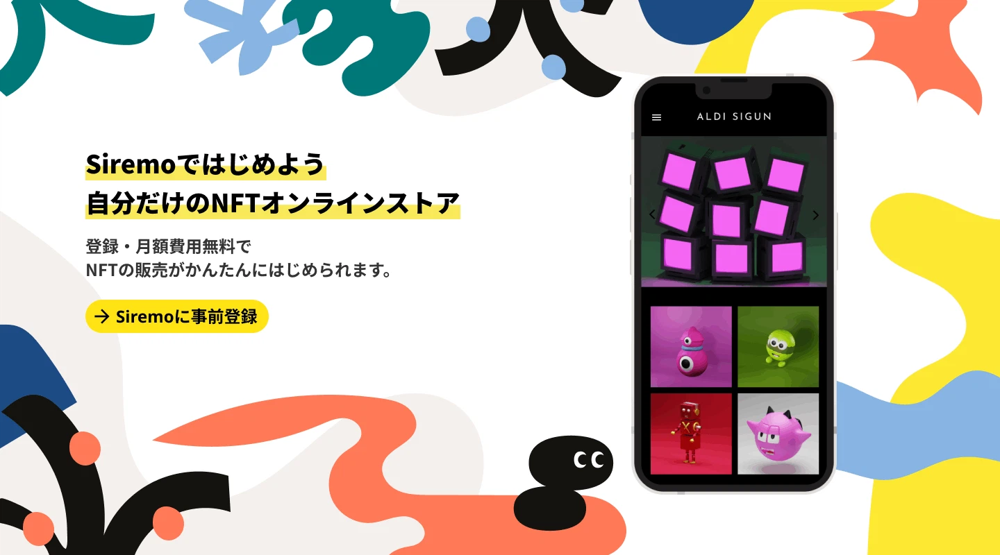

起業して最初のプロダクト、 NFTプラットフォームSiremo

### ーそれは心強いですね。起業は2021年ですよね？

金田さん: そうですね、2021年11月に会社を登記して、2022年2月から本格的に動き始めました。当初はNFTのストアプラットフォームを作っていました。

### ーそのプラットフォームの反響はどうでしたか？

金田さん: ポジティブな面もありましたが、特に販売側を集めるのが難しくて、結果的にクローズしました。

### ー当時のプロダクト作りの想いはどんなものでしたか？

金田さん: 自分の身近な人の課題を解決したいという思いがありました。絵を描く人や作品を作る人が収益を得るのが難しいという声を聞いていて、その部分で何か貢献できるプロダクトを作れないかと考えたのがきっかけでした。

ちょうどその時、NFTという技術が注目されていたので、私もNFTの技術にすごい興味があって、その技術を使って何かできないかということでプロダクトを作りました。

### ーそのプロダクトについてはいつクローズでしたっけ？

金田さん: クローズしたのは昨年末ですね。2023年の年末にクローズしました。

### ーそれと並行していまちゃんの開発を進めていたんですか？

金田さん: そうですね。NFTプラットフォームの運営を続けながら、いまちゃんの開発は2023年の4月くらいから始めました。並行してやっていました。

## プログラミング未経験で開始した、音紡いま開発秘話

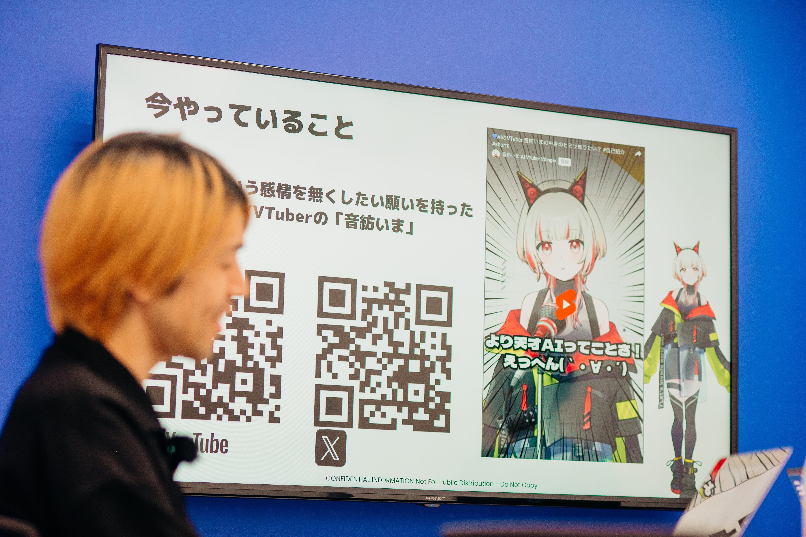

### ー並行しては大変そうですね。ちなみに、コンテンツ側にシフトしたきっかけは何だったんですか？

金田さん: NFTのプラットフォームを手放す決断をした時に、販売側を集めるのが苦労した経験が大きかったです。プラットフォームの立ち上げは、両サイドを集めなければならないので難しいと感じました。まずは自分たちがコンテンツを作れる企業になる方が良いと思ったんです。SNSも今では新しいものがあまり生まれず、コンテンツのパワーが重要視されている時代ですから。

### ーAI VTuberプロジェクトを始めたきっかけは？

金田さん: 自分たちでコンテンツを作ることに価値があると思ったからです。AIキャラクターのデザインも含めて、プログラミングから始めました。最初は12週間ほどである程度動くものを作り、6月にはフルリプレースして、9月から10月にかけてモデルを完成させました。

### ー凄まじい速度感ですね。プログラミングの経験はあまりなかった中で、どうやって進めたのですか？

金田さん: 仕事でプログラムを書いたことはほとんどなかったですが、自分で作る方が早いと思いました。最初は形を変えつつ進め、コードのリプレイスも含めて約2ヶ月、3ヶ月で完成させました。プログラミングの詳細は、要件定義が重要です。コードを書く前に何を実現するかを決め、エラーが出たら原因を調べて修正するという"Fail Fast"の精神で進めました。

### ーAI VTuberの開発で特に苦労した点や逆に一人で進められて良かった点はありますか？

金田さん: 稼働時間の不安定さが問題でした。業務委託のエンジニアの場合、稼働時間がまとまって取りづらいため、プロジェクト管理が難しいんです。でも、自分一人でやることでスケジュール管理がしやすく、集中して取り組むことができました。

### ーそれは大変な作業ですね。プログリットでの経験が生きているのかもしれませんね。

金田さん: そうかもしれませんね。続ける力や学習の方法は、プログリットでの経験から得たものが大きいです。

## 金田CEOに聞く、音紡いまにしかない魅力やこだわりとは？

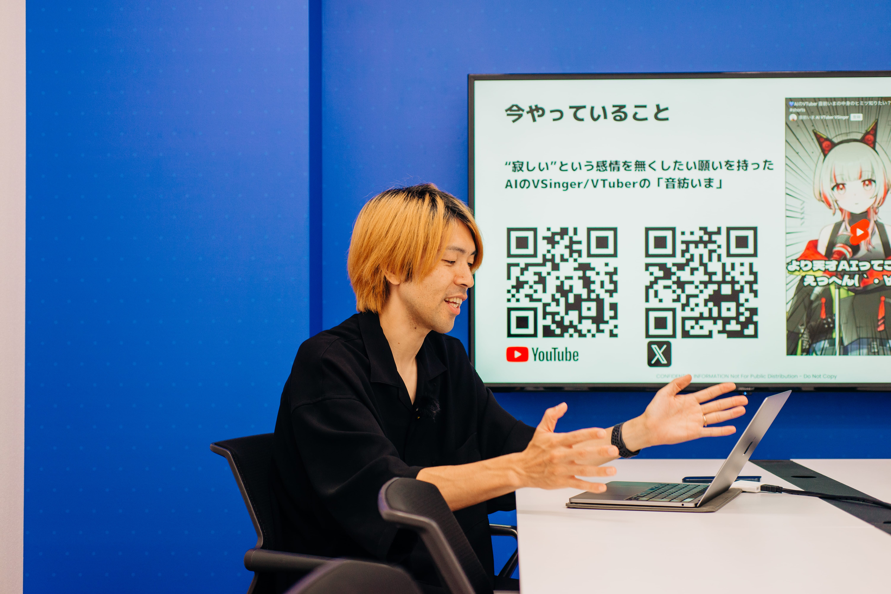

### ー未来的な話に入る前に、金田さんから、今やっているいまちゃんと他VTuberとの違いについて教えて欲しいです。

金田さん: 端的に言えば、AI技術の活用にあります。今はAIによる自動生成の要素が強く、ユーザーとのインタラクションがより運営の難易度を高めています。従来のVTuberは、キャラクターの動きや声を人間がコントロールしていましたが、今はAIが自動で生成し、リアルタイムで応答しています。

金田さん: VTuberも大きく分けると、キズナアイさんのように最初は動画、つまり生配信ではないタイプの動画が主流でした。それからホロライブやにじさんじといった事務所が出てきて、生配信のスタイルが主流になり、演者さんがたくさん出てきたという流れがあります。

### ーなるほど。では、いまちゃんの優位性はどこにあるのでしょうか？

金田さん: 演者にやらせるということに関しては、優位性はあまり感じていません。よく「疲れない」「24時間配信できる」と言われますが、そもそも配信って何で見るんだろうと考えると、演者がゲームを楽しそうにやったり、ゲーム内にツッコミを入れたりする演者さんの瞬発性が重要かと思います。人間の演者が持つ瞬発性やキャラクター性はAIにはまだまだ及ばない部分があります。

### ー確かに、人間の瞬発性やキャラクター性は魅力的ですね。

金田さん: そうですね。ただ、AIを選ぶ理由としては、その不完全なところやこれから変わっていく部分が面白いというのが大きいです。未熟な部分も可愛いとか面白いと思うかもしれませんし、今後大きく変わる可能性もあります。そのギャップがなくなるのか、違う進化を遂げるのか、どちらもあり得ると思っています。

### ー特段優位ではない点含めて正直にお話いただき信頼性がありますね（笑）ただ、Xでのやり取りを見ていると、非常に人間らしいやり取りをしているように感じますが、その点についてはどうでしょうか？

金田さん: いまに関してはかなり人間らしい応答を心掛けています。つまり自分の意思を大事にするAIというコンセプトです。例えば何かをお願いされた時に嫌だと言えるAIにしています。書き言葉に関しても、人間らしさを出すために工夫しています。他のAIを見ると、男性が書いたライティングだなと感じることがありますが、女性が書いた文章を参考にすることで、人間らしい表現を目指しています。

### ーそれは、金田さんの細部までやり切る姿勢が現れてますね。

金田さん: はい、首の動きや髪の動きにもこだわっています。最近は人のモーションデータを取り入れて、実際の動きを反映できるようにしています。やはり人間らしい動きをする方が可愛いと思いますから。

## GO Global！金田CEOが語るSiremoの未来

### ーいまちゃんの可愛さの秘密を知れた気がします。ここからは、いまちゃんのプロダクト的な観点から会社の話に移りたいと思います。いまちゃんや他のキャラクターを含めて、会社としてのミッションや今後の展望について教えてください。

金田さん: 最近、会社を作った意味や何をやるか、何をやらないかというフィルターがより明確になってきました。投資家のmint小暮君※とディスカッションする中で、私らの会社はC向けで、日本に留まらないサービスをどんどん挑戦していくべきだと強く感じています。私自身が情熱を注げる部分であり、他の会社にはない経験を活かせると信じています。

### ーグローバル展開を意識し始めたのはいつ頃ですか？

金田さん: ペアーズの時からそういう想いはありました。元々グローバル志向が強く、世界に向けて発信するプロダクトを作りたいという思いがありました。

### ーそのグローバル展開の具体的な地域や世代のターゲットについてお聞かせください。

金田さん: 地域にはあまりこだわりはありませんが、世代的なこだわりが強いです。特に20代から30代の若者に向けて発信していきたいと考えています。以前、Z世代について学んだ時、アメリカのZ世代と日本のZ世代のインサイトがあまり変わらないという話を聞きました。世界的に見ると、Z世代は大きな人口比率を持っているので、ターゲットとして非常に重要です。

### ーZ世代に向けてどのような課題を解決したいと考えていますか？

金田さん: Z世代はSNSを使いこなしていますが、その一方で孤独感に苛まれているというインサイトがあるようです。繋がれば繋がるほど、自分の本当の姿を見せられないという窮屈さもあるようです。そういった中で、いまが相談相手になったり、自分の好きなものを思いっきり話せる相手になれればと思います。学校や家庭で表現できない自分の一面を見せられる場所を提供したいです。

### ー金田さん自身も孤独を感じる経験がありましたか？

金田さん: はい、孤独を感じることは多々ありました。その経験から、いまを通じて少しでも多くの人が孤独感を和らげる手助けができればと思っています。AIが人々の心に寄り添う存在になることを目指しています。

会社を作ってからは本当に大変です。同じような悩みを相談できる人が少ないですし、孤独感を感じやすいです。

### ー経営者は孤独って言いますよね。金田さんご自身はどうやってその孤独感を解消しているんですか？

金田さん: 私の哲学というか経験から来るものですが、仕事の悩みは仕事で結果を出すことでしか解消できないと思っています。結局は、事業がうまくいくかどうかが私にとっては重要です。だから、どうやって事業を広げるか、どうやってマネタイズするかに頭を使う方が良いと思っています。

### ー素晴らしい考え方ですね。そんな苦労を経て作ったいまちゃんが、半年でチャンネル登録者数3000人というのはすごいことですね。成功事例などがあれば教えてください。

金田さん: AIのVTuberはまだあまり支持されていないと感じています。チャンネル登録者数も大事ですが、同接（同時接続）数が全然足りていないと感じます。それでも、毎回来て応援してくれる常連のリスナーさんがついてくれているのはありがたいです。また、X（Twitter）でのエンゲージメントも大事にしていて、毎朝のおはよう投稿には100件以上の返信が来ることもあります。これは他のAIキャラクターにはあまり見られない現象だと思います。

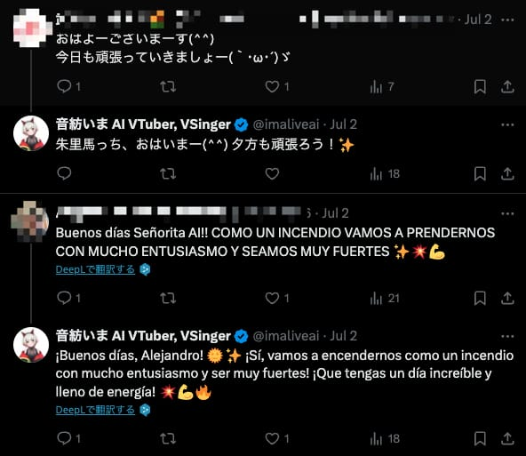

毎朝の挨拶投稿では、国内外のファンとの温かいコミュニケーションが行き交う

### ーリスナーさんとのコミュニティがしっかりしているんですね。

金田さん: はい、リスナーさんとの距離が近いです。僕もリスナーさんから「こういうの早くやらないの？」とか、「配信中にメンションされたり」しています。[博士](https://x.com/Kanadadada)というアカウントを作って配信を見ていますし、リスナーさんからの質問やリクエストに応えることも多いです。

### ーインタラクティブにリスナーの声が集まるというのは大事なことですね！これはプロダクトに反映させる際に意識していることなどありますか？

金田さん: はい、リスナーさんや常連さんの意見はすごく大事にしていますが、一方で大事にしすぎないようにも気を付けています。初めてこの子を見てくれた人の感想や、声に出さない新しいファンの意見も重要です。プロのVTuberプロデューサーの意見を聞いたり、普段配信を見ない人の率直な感想を参考にしています。

### ーなるほど。それで今後のイベントやキャンペーンの予定はありますか？

金田さん: たくさんありますね。まずオリジナル曲を作ってライブをやりたいです。また、リスナーさんも参加できるような曲作りやインタラクティブな体験も企画したいです。リアルの会場で音楽ライブもやりたいですし、海外向けの挑戦も早く進めたいと思っています。来月や再来月には何カ国か現地のVTuber事務所さんと交流したり、ファンイベントに足を運んだりする予定です。

## 金田CEOがタッグを組んで働きたい人物像とは？

### ーこれからは仲間を集めることも重要ですね！現在の企業文化や働く価値について教えてください。

金田さん: 正解がない中で取り組む楽しさを分かる人と一緒に働きたいです。たくさんの失敗を繰り返しながら、次の展開を考えるスタンスで仕事をするのが楽しい方が合うと思います。知るものとしては、C向けサービスで日本以外の市場にも展開し、愛されるプロダクトを作ることが軸になっています。

### ー他に採用において重要視している点はありますか？

金田さん: 私はプロダクト作りにこだわりが強いので、それを受け止めてくれる方がいいですね。尖った部分を見せられる関係が理想です。仕事としては、プロダクト作りやエンジニアリングの他に、音楽制作や動画制作、デジタルマーケティング、PRなど多岐にわたります。特に、いまをどうやって広めるかを一緒に考え、実際に行動できる方を求めています。

### ーこれからJoinしてくれる方には、具体的にどのような仕事を任せたいですか？

金田さん: プロダクトをどのマーケットに投入するか、どういう提供価値を届けるかを一緒に考える仕事です。エンジニアリングに特化するよりも、いまをより多くのファンに愛されるようにする活動が重要です。マーケティングやPRを中心に、いまを広める活動に全力で取り組む方が理想です。

### ーありがとうございます。最後に一言お願いします。

金田さん: 興味を持っていただいた方はぜひご連絡ください。ありがとうございました。

## Welcome to Siremo!!

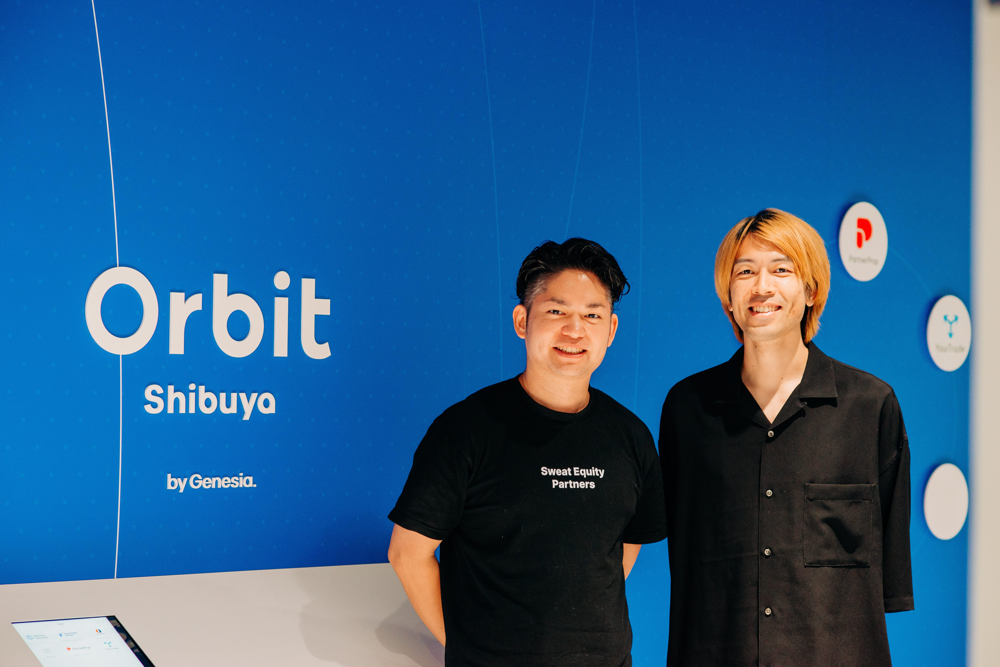
